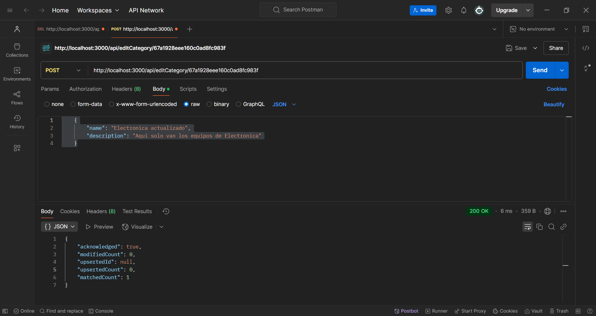
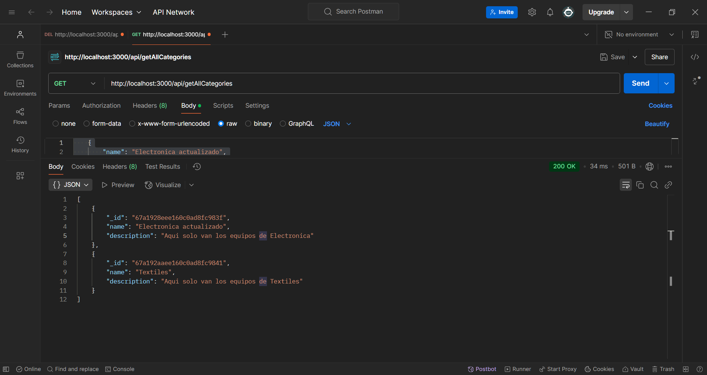

# API con Node.js

Este es un proyecto de API desarrollado con Node.js que proporciona funcionalidades para gestionar categorías, productos, proveedores, transacciones y usuarios para un sistema de invetario.

## **Tabla de Contenidos**
- [Tecnologías utilizadas](tecnologías-utilizadas)
- [Instalación](#instalación)
- [Estructura del Proyecto](#estructura-del-proyecto)
- [Uso](#uso)
- [Rutas de la API](#rutas-de-la-api)
  - [Categorías](#categorías)
  - [Productos](#productos)
  - [Proveedores](#proveedores)
  - [Transacciones](#transacciones)
  - [Usuarios](#usuarios)
- [Ejemplos con Postman](#ejemplos-con-postman)
- [Contribuir](#contribuir)

---

## **Tecnologías utilizadas**

*   Node.js
*   Express
*   MongoDB
*   Mongoose
*   dotenv
*   cors

## Instalación

1.  Clona este repositorio:
    
    git clone https://github.com/SooyAldahir/api_node.js

2.  Instala las dependencias:
    
    npm install

3.  Crea un archivo .env en la raíz del proyecto y añade la URI de conexión a tu base de datos MongoDB:
    
MONGODB_URI=mongodb+srv://<usuario>:<contraseña>@<cluster>.mongodb.net/<nombre_base_datos>?retryWrites=true&w=majority

## **Estructura del Proyecto**
```
📂 src
 ├── 📂 config          # Configuración de la base de datos
 ├── 📂 controllers     # Controladores de la API
 ├── 📂 models          # Modelos de datos con Mongoose
 ├── 📂 routes          # Definición de rutas para cada entidad
 ├── server.js          # Archivo principal que inicia el servidor
 ├── .env               # Variables de entorno (no incluir en el repositorio)
 ├── package.json       # Dependencias y configuración del proyecto
```

## Uso

1.  Inicia el servidor:
    
    node server.js

2.  La API estará disponible en http://localhost:3000 (o el puerto que hayas configurado).

## **Rutas de la API**

### **Categorías**
- **Crear categoría** (`POST /createCategory`)
    ```json
    {
        "name": "Electrónica",
        "description": "Productos tecnológicos y gadgets"
    }
    ```
- **Obtener todas** (`GET /getAllCategories`)
- **Obtener una por ID** (`GET /getCategory/:id`)
- **Editar** (`POST /editCategory/:id`)
- **Eliminar** (`DELETE /deleteCategory/:id`)

### **Productos**
(Similar a categorías, cambiar `/createProduct`, `/getAllProducts`, etc.)

### **Proveedores**
(Similar a categorías, cambiar `/createProvider`, `/getAllProviders`, etc.)

### **Transacciones**
(Similar a categorías, cambiar `/createTransaction`, `/getAllTransactions`, etc.)

### **Usuarios**
(Similar a categorías, cambiar `/createUser`, `/getAllUsers`, etc.)

---

## Modelo de datos

## Categorías:

```javascript
function getCategoryModel(){
    return{
        name: "",
        description: ""
    };
}
```
## Productos:

```javascript
function getProductModel(){
    return{
        name: "",
        category: "",
        price: 0.0,
        stock: 0
    }
}
```
## Proveedores:

```javascript
function getSuppliersModel(){
    return{
        name: "",
        contact: "",
        address: "",
        email: ""
    }
}
```
## Transacciones:

```javascript
function getTransactionModel(){
    return{
        type: "",
        date: new Date(),
        product_id: "",
        count: 0,
        user_id: "",
        notes: ""
    }
}
```
## Usuarios:

```javascript
function getUserModel(){
    return{
        name: "",
        rol: "",
        email: "",
        phone: ""
    }
}
```
## **Ejemplos con Postman**
### **Crear una Categoría**

```sh
POST http://localhost:3000/api/createCategory

{
     "name": "Electronica actualizado",
     "description": "Aqui solo van los equipos de Electronica"
}
```    
### **Obtener todas las Categorías**
```sh
GET http://localhost:3000/getAllCategories

[
    {
        "_id": "67a1928eee160c0ad8fc983f",
        "name": "Electronica actualizado",
        "description": "Aqui solo van los equipos de Electronica"
    },
    {
        "_id": "67a192aaee160c0ad8fc9841",
        "name": "Textiles",
        "description": "Aqui solo van los equipos de Textiles"
    }
]
```
## **Ejemplo de Uso**
Aquí tienes un ejemplo del sistema funcionando actualizando una categoria:



Aquí tienes un ejemplo del sistema funcionando mostrando todas las categorias:




## **Contribuir**
1. Haz un fork del repositorio.
2. Crea una nueva rama (`git checkout -b feature/nueva-funcionalidad`).
3. Realiza tus cambios y haz commit (`git commit -m "Agrego nueva funcionalidad"`).
4. Sube los cambios a tu fork (`git push origin feature/nueva-funcionalidad`).
5. Abre un Pull Request para revisar los cambios.

¡Gracias por contribuir! 🚀
